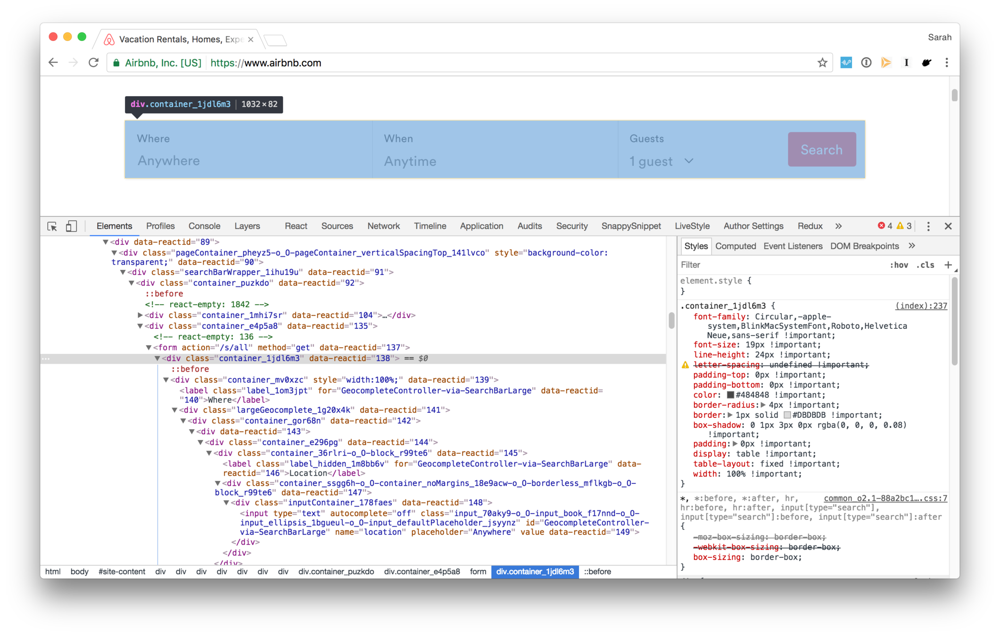
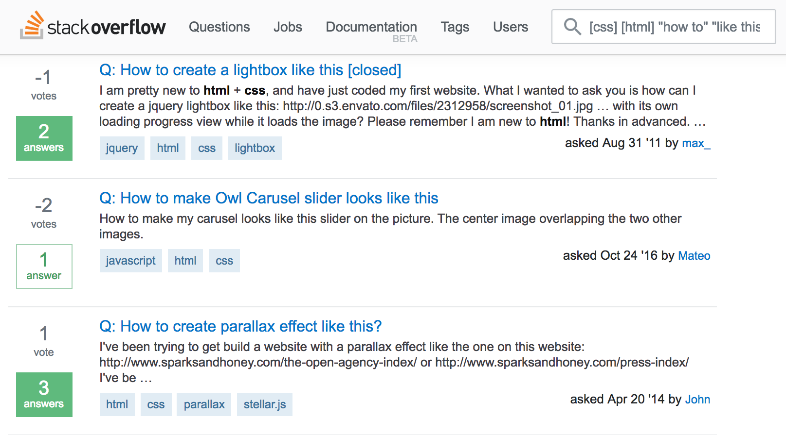
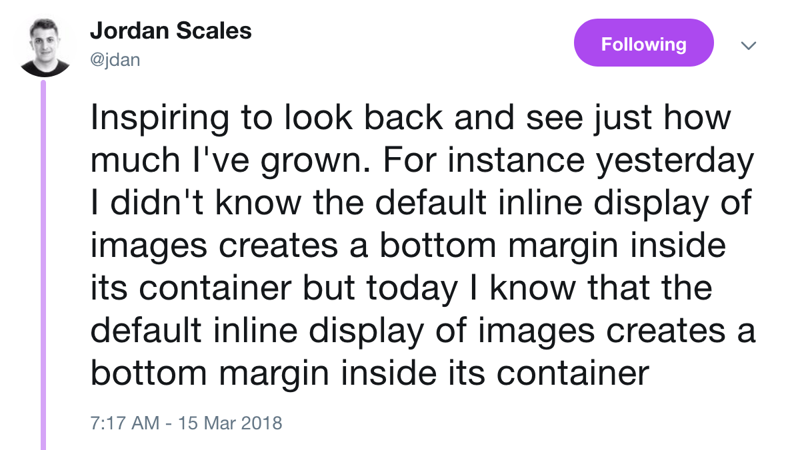

- problem
- technical contribution
- evaluation

---

- talk about needfinding explicitly
  - saying "this is hard for experts" distracts from the talk
- obstacles, characteristics can be illustrated through concrete examples
  - people are overwhelmed by missing conceptual knowledge
- what is visual regression as a technique

- slide numbers on

# CSS is hard


<!-- say what's on your slide -->

# Why professional examples?

TODO

# Any website is an example


# ...in theory



# What are the problems?

we did some needfinding

- TODO: Research questions. What are we investigating?
- Supporting novices

---


::: notes
Modern webpages are overwhelming
:::

# Novices think in terms of visual output



cites

# Tools can be misleading


- 2 things we discovered in needfinding
- Missing the thread

# Ineffective properties


# Ineffective properties


# Why are these properties ineffective?

- Why are they ineffective?
- Why can't Chrome detect them?

# Unintuitive properties

```css
.footer {
  color: red;
  font-size: 20px;
  margin: 10px;
}
```

# Unintuitive properties

```css
.footer {
  position: relative;
  display: flex;
  flex: 1;
}
```

# Experts struggle, too



# Experts struggle, too


# What can we do?

# Sense-making

Quintana et al. 2004

> use representations and language that **bridge learners' understanding** with expert formalisms

- make slides for characteristics

# Web inspection tools should be aware of **visual relevance**.

# Ply

demo stuff/screenshot

# Visual relevance

original


. . .

disabling `width: 100%;`

{style="width: 50%;"}

. . .

regression!


# Relevance pruning

screenshot from Ply w/ code reduction

# Implicit dependencies

:::::::::::::: {.columns}

::: {.column width="40%"}
<div style="position: relative;">
  <div style="width: 300px; height: 200px; background: red;"></div>
  <div style="position: absolute; z-index: -1; width: 300px; height: 200px; background: blue; top: 50px; left: 50px;"></div>
</div>
:::

::: {.column width="60%"}

```css
.blue { 
  position: absolute;
  z-index: -1;
  top: 50px;
  left: 50px;
}
```

:::

::::::::::::::


# `z-index: -1;`


:::::::::::::: {.columns}

::: {.column width="40%"}

<div style="position: relative;">
  <div style="width: 300px; height: 200px; background: red;"></div>
  <div style="position: absolute; width: 300px; height: 200px; background: blue; top: 50px; left: 50px;"></div>
</div>

:::

::: {.column width="60%"}

```css
.blue { 
  position: absolute;
  /* z-index: -1; */
  top: 50px;
  left: 50px;
}
```

:::

::::::::::::::


# `position: absolute;`


:::::::::::::: {.columns}

::: {.column width="40%"}

<div style="position: relative;">
  <div style="width: 300px; height: 200px; background: red;"></div>
  <div style="z-index: -1; width: 300px; height: 200px; background: blue; top: 50px; left: 50px;"></div>
</div>

:::

::: {.column width="60%"}

```css
.blue { 
  /* position: absolute; */
  z-index: -1;
  top: 50px;
  left: 50px;
}
```

:::

::::::::::::::


# `position` and `z-index`


:::::::::::::: {.columns}

::: {.column width="40%"}

<div style="position: relative;">
  <div style="width: 300px; height: 200px; background: red;"></div>
  <div style="width: 300px; height: 200px; background: blue; top: 50px; left: 50px;"></div>
</div>

:::

::: {.column width="60%"}

```css
.blue { 
  /* position: absolute; */
  /* z-index: -1; */
  top: 50px;
  left: 50px;
}
```

:::

::::::::::::::


# `z-index` and `position` are related

{width=50%}

<https://www.w3.org/TR/css-position-3/#propdef-z-index>

# `z-index` and `position` are related

{width=50%}

<https://www.w3.org/TR/css-position-3/#propdef-z-index>

# "positioned elements"

:::::::::::::: {.columns}

::: {.column width="40%"}


:::

::: {.column width="60%"}

> "An element is said to be positioned if its position property has a value other than static."

<small><https://www.w3.org/TR/css-position-3/#box-offsets-trbl></small>

:::

::::::::::::::


# `z-index` depends on `position`!

# Implicit dependencies demo

TODO

# Evaluation

# Study 1

- We tested this with $n$ people
- We had them replicate this task
- Here are the results

# Results

- People were able to identify relevant CSS from a professional webpage
- Comparison side-by-side
- Didn't waste time copying over properties that didn't work

# Study 2

- Looking at examples of dependencies

# Results

- Look at other talks that are online

# More in the paper

- Sense-making theory
- Applying VRT to detecting visual subtypes
- User studies
