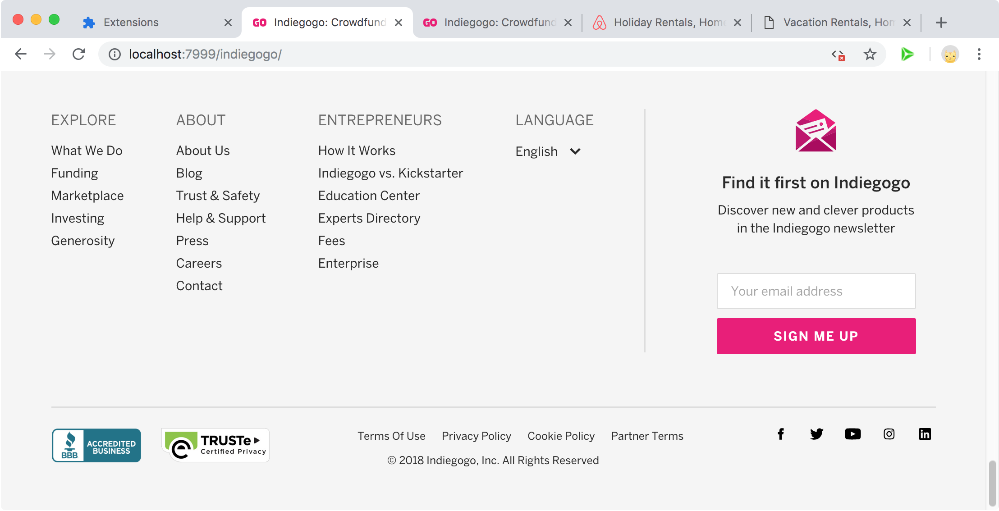
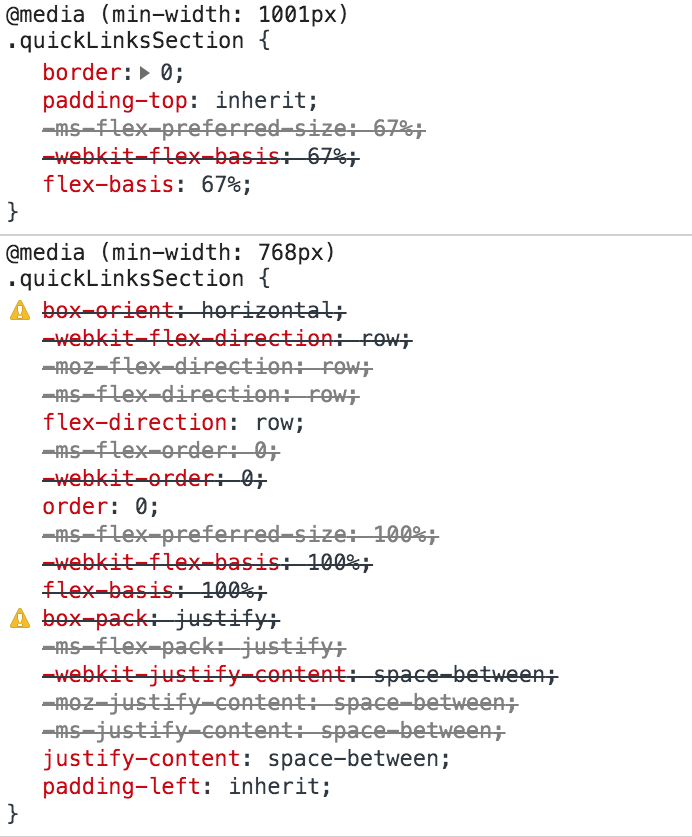

## Modern web design is complex


:::notes
- What do we mean by this?
- Modern webpages are complex applications with rich graphic and user interface designs
:::

## "How do I make this?"


:::notes
- Wouldn't it be great if I could say, "I want to make something _like that_"?
- Theoretically, you can -- devtools are available, pages are open source
:::

## Modern **HTML, CSS** are complex


:::notes
- But richness in design comes at a cost: frameworks, components, application demands
- Prior work has focused on interactive functionality
- "Look" can be just as hard as "feel"!
:::

## Needfinding

- **Surveyed** undergraduate web developers ($n = 20$)

  - Experiences with tutorials, inspecting examples

- In-person **follow-up study** ($n = 10$)

  - Replicating features from professional webpages using Chrome DevTools (CDT)

<!-- TODO: Include images of Uber, etc. -->


:::notes
We conducted two stages of needfinding.

1. Surveyed 20 undergrad web devs about their experiences learning web development, using tutorials, and inspecting professional examples

2. Followed up with 10 of them for an in-person study, during which they replicated web features on professional webpages using CDT

More details in paper
:::

## Why inspect professional examples?


:::notes
- First thing we tried to understand: are professional examples even worth studying? Why not just use tutorials?
- Here are some results
:::

---

<!-- TODO: Add images of professional examples -->

:::::: {.columns}
::: {.column width="50%"}
### Professional webpages

- Loads of sources

- Easy to find opportunistically

:::
::: {.column width="50%"}
### Tutorials

- May not fit user's needs

- Hard to find without domain vocabulary

:::
::::::


. . .


:::::: {.columns style="text-align: left;"}
::: {.column width="50%"}
- **Teach best practices**
:::
::: {.column width="50%"}
- **Easily outdated, too simplistic**
:::
::::::


:::notes
We can divide this question into two categories: benefits of PEs and drawbacks of tutorials.

## Precision

- Since any webpage has the potential to be an example, the odds are good that users can find something that exactly matches what they have in mind.

- Conversely, authoring tutorials is expensive so there are far fewer of them. Users expressed frustration when they found a tutorial but the outcome wasn't exactly what they were looking for. 

<!-- TODO: Example -->

## Discoverability

- Likewise, professional examples allowed participants to discover interesting examples during their normal Web usage.

- OTOH, tutorials often use domain-specific terminology and keywords like "parallax scrolling" or "hero image" that are not obvious to novices -- they struggled to find relevant resources

. . .

## Pedagogical value

This last criterion was _not_ raised by users during needfinding, but it's one we're interested in as a research community.

Since professional examples are more realistic than toy examples, can they:

- expose **authentic development practices** that arise on production webpages
- serve as **concrete, explorable examples** of abstract CSS concepts
:::


---

<h2 class="h1">Obstacles to inspection</h2>

## Novices rely on visual intuition

[@Gross:2010:TTF:1937117.1937123; @JoelBrandt:2010ula; @Ko:2004td]


:::notes
First, some context: we know from prior work that novice programmers think about programs in terms of visual outcomes, but struggle to relate these outcomes to program constructs.
:::

---


{.captioned}


. . .

:::::: annotated
{.captioned}


::: {.annotation .right .top style="width: 30%; height: 78%;"}
:::
::::::


:::notes
Our needfinding corroborates this well. The fundamental pattern that all of our users followed went something like this:

1. Identify a visual entity of interest on the page, e.g. a row of grid cells
2. Formulate a hypothesis about the implementation **based on prior knowledge**
:::


## "How are the cells aligned?"


::::::::: columns
:::::: {.column width=50%}
::: annotated


::: {.annotation .left style="top: 61.5%; height: 4%; border-color: blue;"}
:::
:::
::::::

:::::: {.column width=50%}
- `float: left;` ?

- `width: 33%;` ?

::: framed
Users don't know:

1. **What** to look for
2. **Where** to look for it

:::
::::::
::::::::::


:::notes
At this stage, users formed hypotheses about _how_ such visual features might be implemented. The quality of these hypotheses depended on their CSS background knowledge, which was limited.

Leads to two problems:

1. The right answer isn't what novices are expecting. Even if they saw the right answer, they might not recognize it.
2. There is so much unfamiliar information shown that novices are unlikely to even find the right answer to begin with.
:::

## Problem 1: Visually ineffective properties

("where" to look)


:::notes
But it's not just about finding a needle in a haystack. As we discovered, there is a specific reason novices struggled to use CDT to explore professional examples.
:::

## Inactive styles in CDT


:::notes
Not all properties are active on a page at once. For instance, a property is inactive if it's shadowed by a more specific assignment in the cascade. It might also be a parse failure (which is actually fairly common on production webpages due to vendor prefixing).

If you've used CDT before, you may remember that the UI indicates when a property is inactive. This screenshot gives a representative selection of styles: properties are struck through, greyed out, accompanied by a warning sign, or some combination of the above.
:::


## Not all active properties have observable effects!


::: annotated


::: {.annotation .filled style="width: 50%; height: 26%; top: 23%; left: 21%;"}
:::
::: {.annotation .filled style="width: 50%; height: 4%; top: 60%; left: 21%;"}
:::
::: {.annotation style="width: 50%; height: 2%; top: 63%; left: 21%; border-color: blue;"}
:::
:::


:::notes
Based on this, it's reasonable to believe that properties that appear normal are, in fact, relevant.

But as we saw during needfinding, this is often not the case! Here, all the properties shaded in red can be removed completely from the page without any change to the component in question.

TODO: Elaborate on why

This example illustrates a fundamental misalignment between users, who rely on visual intuition to guide their search, and browser tools, which have no knowledge of visual effects.
:::


## Problem 2: Missing conceptual knowledge

("what" to look for)


:::notes
Recall that the second problem was one of prior knowledge: users formulated hypotheses about how effects were implemented based on their conceptual understanding of CSS.

Usually, these hypotheses were wrong or shallow because users had only been exposed to very simple or outdated CSS.
:::

## How useful are professional examples?

> Either a 7 [out of 10] or a 1 [out of 10], if there’s some **concept I don’t understand**. If there ended up being something that required some background knowledge...**you just get lost**.

## Example: Indiegogo footer


:::::: annotated



::: {.annotation style="width: 55%; height: 40%; top: 20%; left: 5%;"}
:::
::::::


:::notes
Here's the footer from the Indiegogo homepage. I want to concentrate on these four columns over here.
:::


---


:::::: columns
::: {.column width=50%}



:::

::: {.column width=50%}


:::
:::::::


:::notes
Here's the CSS that's been applied to this element. It didn't fit in one column, so I split it up for your reading pleasure.

NB. This is a great example of a few characteristics of modern production stylesheets:

1. `@media` queries for responsiveness across different window breakpoints
  - First rule applies to viewports 1001px or wider, second to 768px or wider, and third is the default (mobile-first) design
  - Simple shadowing: `padding-top: inherit;` in the first rule shadows `padding-top: 40px`; in the last rule

  - Also something subtler: ABA overriding (TODO: finish me)

2. Autoprefixing for cross-browser compatibility
  - `display` has 6 values: `box`, `-webkit-flex`, `-moz-flex`, `-ms-flexbox`, `-ms-flex`, and finally `flex`
:::

---

```css
.quickLinksSection {
  display: flex;
  flex-basis: 67%;
  padding-right: 25px;
  justify-content: space-between;
}
```


:::notes
It turns out that if all you want to do is replicate the footer I showed you a couple of slides back, you can replace all of that with these four lines of code. If you're a user trying to replicate this site, it would already be great if we had a tool to hide all of the visually-ineffective properties.
:::


## "I've heard of Flexbox but that's it"

```css
.quickLinksSection {
  display: flex;
  flex-basis: 67%;
  padding-right: 25px;
  justify-content: space-between;
}
```


:::notes
But recall that our goal is to help novices _learn_ CSS by example, not just reproduce designs.

For this situation, a minimal slice is necessary but not sufficient. A lot of the users in our studies had heard of Flexbox but didn't know anything else about it, so looking at these four properties wouldn't tell them anything about how it works.

So if you're a novice CSS user who relies heavily on visual guess-and-check to reason about stylesheets, what conceptual knowledge are you missing?
:::

## Not all properties are visually intuitive

```css
.simple {
  color: red;
  font-size: 16px;
  margin: 10px;
}
```

. . .


```css
.quickLinksSection {
  display: flex;
  flex-basis: 67%;
  justify-content: space-between;
}
```

:::notes
First of all, you have to predict the effect of each property.

If I show you some CSS like this, it's fairly clear that each property corresponds 1-to-1 with a discrete visual effect. This is the type of CSS most people learn.

. . .

On the other hand, it's harder to infer what the properties in this Indiegogo example do. (I've left out `padding-right` because it falls into the former category.) What does `display` do? It's not immediately clear.
:::

## Not all properties are independent

```css
.simple {
  color: red;
  font-size: 16px;
  margin: 10px;
}
```

. . .


```css
.quickLinksSection {
  display: flex;
  flex-basis: 67%;
  padding-right: 25px;
  justify-content: space-between;
}
```

:::notes
But there's also a second, subtler issue.

In the first block of code, these properties are essentially orthogonal. Setting the text color to `red` is totally independent of setting the margin to 10 pixels.

. . .

On the other hand, this is _not_ true of the second example. Some of these properties are related -- I'll spell out exactly how in a moment.
:::

## Dependencies between properties

```css
.quickLinksSection {
  display: flex;
  flex-basis: 67%;
  padding-right: 25px;
  justify-content: space-between;
}
```

. . .


```css
.quickLinksSection {
  display: flex;
  flex-basis: 67%;
  /* ------------------------------------- */
  padding-right: 25px;
  /* ------------------------------------- */
  justify-content: space-between;
}
```

:::notes
Let's say you're a novice CSS user, you've heard of Flexbox but never used it and don't really know what any of the properties do. (Or, let's be real, you're an advanced CSS user and you don't have the CSSTricks Flexbox guide open in another tab.) You want to understand how these four lines work together to produce the four-column footer on the Indiegogo website.

. . .

A reasonable first hypothesis might be to group the properties like this:

- `flex-basis` has "flex" in the name, so it probably depends on `display: flex;`.
- I know what `padding-right` does, so that's probably irrelevant.
- I don't know what `justify-content` does, so we'll just put that in its own group.
:::


---

### Wrong

```css
.quickLinksSection {
  display: flex;
  flex-basis: 67%;
  /* ------------------------------------- */
  justify-content: space-between;
}
```

### Correct

<!-- TODO: Animations -->

```css
.quickLinksSection {
  display: flex;
  justify-content: space-between;
  /* ------------------------------------- */
  flex-basis: 67%;
}
```

:::notes
Tragically, while grouping based on substring match is a decent heuristic, it's also misleading in this case.

- `flex-basis` actually behaves totally independently of `display: flex;`
- `justify-content`, however, _does_ depend on `display: flex;`
:::


## Designing a learner-friendly web inspector

1. **Hide visually-irrelevant code** from inspector output to minimize information overload and support novices' visual approach to sense-making

2. **Embed contextual guidance** into inspector output to explain how CSS properties coordinate to produce visual effects.

[@Quintana:2004bg]


:::notes
We developed a set of design guidelines based on our observations, by adapting prior work done by Chris Quintana et al. on software-supported sense-making.

Their guidelines are:

1. Use representations and language that bridge learners' understanding (which in our case is visual intuition)

2. Embed expert guidance into the sense-making process to provide missing domain knowledge
:::

---

<h2 class="h1">Ply</h2>


<http://localhost:7999/indiegogo>


## A DOM/CSS inspector

<!-- TODO: Screenshot -->

:::notes
As a DOM/CSS inspector, Ply is conceptually similar to CDT or Firebug.

- You can launch it on any webpage of interest
- Select a component to inspect
- Unfold the DOM subtree, highlight nodes on the page

- Click on a node to see its matched CSS styles
- Click on properties to toggle them on and off, etc.

Things you can't yet do:

- Mutate anything other than toggling properties (e.g. adding rules, modifying node attributes, changing values)
:::

## Relevance pruning

<!-- TODO: GIF -->

> **Hide visually-irrelevant code** from inspector output to minimize information overload and support novices' visual approach to sense-making


## Conceptual filters

<!-- TODO: GIF -->

> **Embed contextual guidance** into inspector output to explain how CSS properties coordinate to produce visual effects.


---

<h1 class="h2">Visual Relevance Testing</h1>

## Inspiration: Visual regression testing


:::notes
Our approach is inspired by a technique called visual regression testing, which is unrelated to statistical regression.

- Start with a UI codebase and take screenshots of key routes
- These screenshots are groundtruth
- Check in a change
- Re-render application and take screenshots of the same routes
- Compare to previous screenshots
- If there is a visual difference -- a potential _regression_
:::

## Key idea

A property is **visually effective** if and only if its deletion causes a regression

---

{.captioned}

. . .

{.captioned}

. . .

{.captioned}


::: framed
$\implies \quad$ `width: 100%;` is **effective**
:::

---

{.captioned}

. . .

{.captioned}

. . .

{.captioned}


::: framed
$\implies \quad$ `display: block;` is **ineffective**
:::


## Implicit dependencies

```css
.quickLinksSection {
  display: flex;
  justify-content: space-between;
}
```

A property `justify-content`{style="color: red;"} _depends on_ a property `display: flex;`{style="color: blue;"} if 

- when `display: flex;`{style="color: blue;"} is active, `justify-content`{style="color: red;"} is **visually effective**
- when `display: flex;`{style="color: blue;"} is disabled, `justify-content`{style="color: red;"} is dead code

<!-- TODO: GIFs -->


---

<h2 class="h1">Evaluation</h2>

## Study 1: Replication speed


::: framed
Does pruning ineffective properties help developers replicate features more quickly?
:::

## Setup


:::::: columns
::: {.column width=50%}
- $n = 12$, between-subjects
- 40 minutes
- CDT as control

:::

::: {.column width=50%}
- Three milestones (grid, images, yellow)
- Other styling (colors, typography)
:::
::::::


## Cumulative completion times

{width=100%}

## Results

- Ply users 3.5 times faster to first milestone
  - $t(10) = -3.5, p = .01$
  - Ply: $\mu = 2.5, \sigma = 1.64$
  - CDT: $\mu = 8.83, \sigma = 4.167$

- Overall 50\% faster (not statistically significant, likely due to small $n$)
  - $t(10) = -2.4, p = .06$
  - Ply: $\mu = 16.67, \sigma = 1.63$
  - CDT: $\mu = 24.83, \sigma = 8.08$

- Decreased variance in Ply condition, across all milestones


## Study 2: Conceptual learning


::: framed
How does embedded guidance help novice developers learn new CSS concepts?
:::

## Setup


:::::: columns
::: {.column width=50%}
- $n = 5$
- Very inexperienced users
- Pre- and post-tests
- Tasks: implicit dependencies and visual subtypes (in paper)


:::

::: {.column width=50%}


:::
::::::

## Results

TODO: Finish this

## More in the paper

- Background: sense-making, authentic learning
- System implementation
- Technique descriptions
- Visual subtypes
- Many more examples

