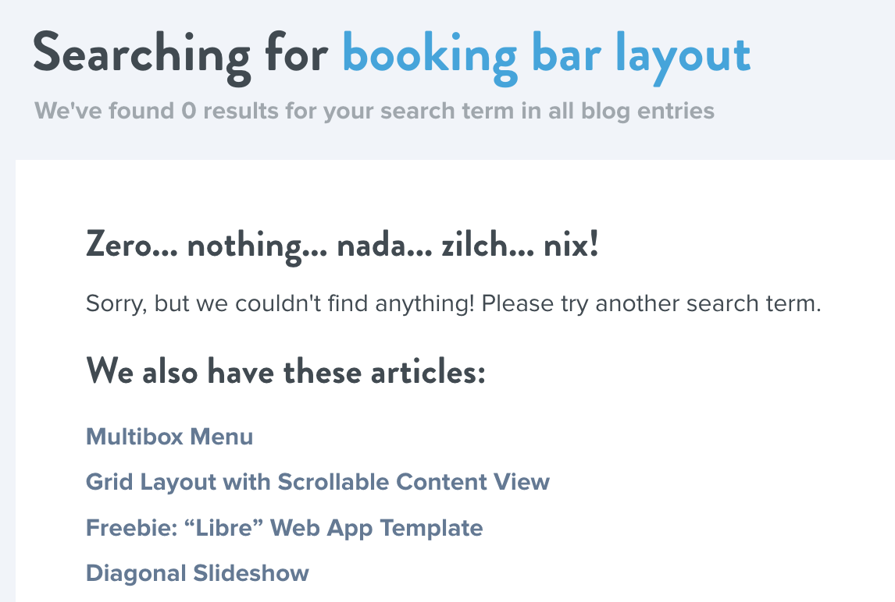
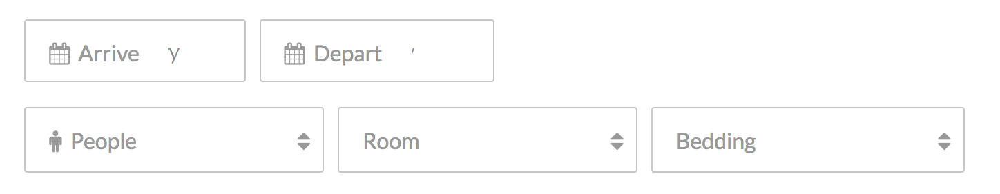
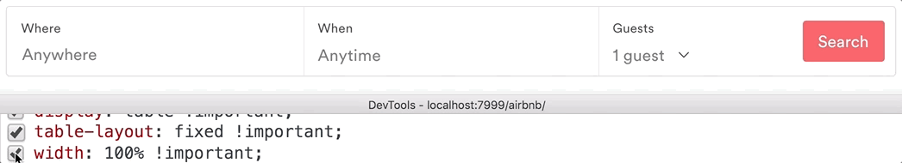
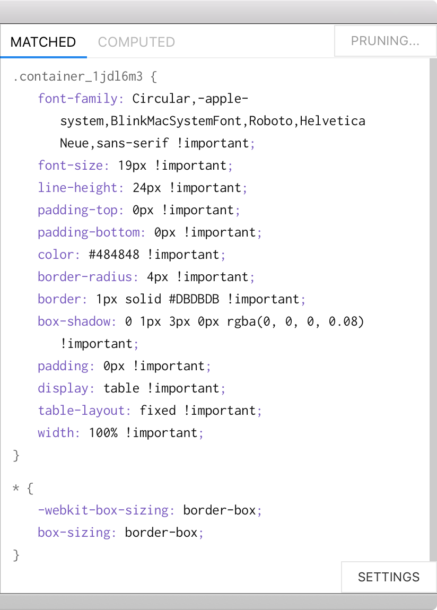
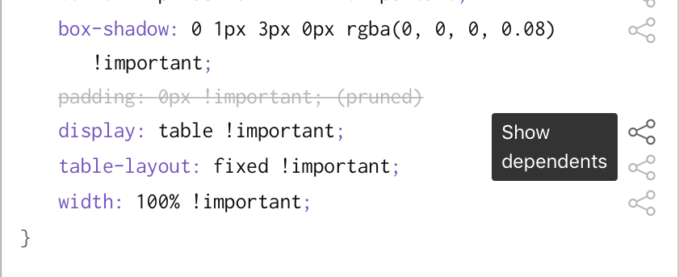
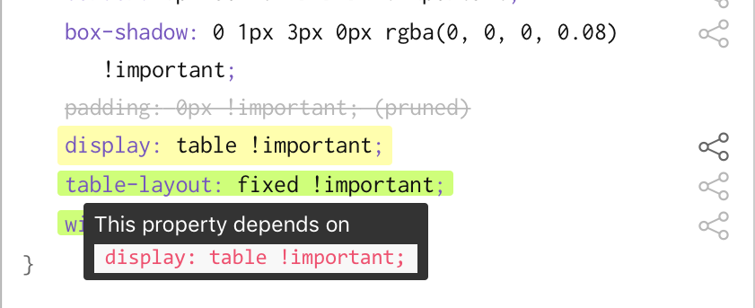
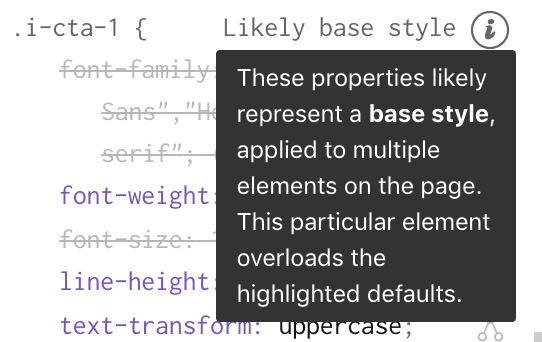

## Modern web design is complex and hard to learn

{.captioned}


:::notes
Modern webpages are complex, full-featured applications with really impressive designs, and there are a lot of people interested in learning to style these rich interfaces.

The nice thing about the Web is that even if I'm an inexperienced developer, it's really easy to stumble upon tons of interesting designs during my regular browsing sessions.
:::


## "How do I make a form like this?"


:::notes
And so let's say I come across this example from the Airbnb homepage, and I'd like to replicate this booking form here.

Specifically, I want to create a form with each field in its own column.
:::


## Tutorials may be hard to find

{.captioned .shadowed}


:::notes
So one thing you can do is to search for tutorials on a websites like CSSTricks or Codrops.

But it's often difficult to specify exactly what aspect of the design you'd like a tutorial for.
:::


<!-- ## Jargon-heavy keywords -->

<!-- {.captioned.captioned-light} -->


<!-- ::: notes -->
<!-- On top of that, many tutorials use domain-specific keywords like "Material design" or "jump loader animation" that might not be familiar to novices. -->
<!-- ::: -->


## Tutorials aren't quite right


vs.

](img/codepen.png){.shadowed .captioned}


:::notes
But the biggest problem is that tutorials are often _too simplistic_ and not exactly what we're looking for.

Here's a toy example that I found when searching for tutorials. You can see right away that it doesn't quite match the aesthetics of the original, which is dissatisfying.
:::


## Production webpages embed best practices


:::::: columns
::: {.column width=50% style="position: relative; top: 50%; left: 0; transform: translateY(25%);"}
{.captioned}


:::
::: {.column width=50%}

```css
.container {
  display: table;
}
```

:::
::::::


vs.


:::::: columns
::: {.column width=50% style="position: relative; top: 50%; left: 0;"}
{.captioned}


:::
::: {.column width=50%}

```css
.container {
  float: left;
}
```

:::
::::::


:::notes
TODO: Shorter

Moreover, these implementations are actually quite different.

The Airbnb example uses `display: table;` to achieve tabular layout behaviour without actually using a `<table>` element.

The toy example uses floats and clearfix, which is an outdated way of achieving a column layout and doesn't reflect modern best practices.
:::


## Any webpage can be inspected...


:::notes
Now if you're an expert, you can just use the "Inspect Element" feature built into modern browser devtools to inspect the actual DOM and CSS used to construct the page.

And experts perform this sort of debugging and inspection quite frequently, to understand how other webpages implement effects using modern development best practices that tutorials don't always convey.
:::

## But tools are overwhelming for novices


:::::: annotated
{.shadowed}


::: {.annotation .right .top style="width: 30%; height: 78%;"}
:::
::::::


:::notes
Unfortunately, if you're relatively new to web design and you only know basic HTML and CSS syntax but not development practices, the output of the inspector is pretty overwhelming for any nontrivial webpage.


:::


## Contributions

- Needfinding: inspection pain points
- Ply: a visually-aware web inspector
- Two user studies
    - Users replicate CSS 50\% more quickly
    - Learn new concepts


:::notes
So to address these challenges, we make the following contributions:

- what exactly novices find challenging about inspecting production webpage CSS, and what that implies for the design of inspection tools
- I'll walk you through Ply, the tool we built to address these challenges
- and demonstrate how it helped novices replicate a complex design 50\% more quickly and learn new concepts
:::


## Needfinding

- **Surveyed** undergraduate web developers ($n = 20$)

  - Experiences with tutorials, inspecting examples

- In-person **follow-up study** ($n = 10$)

  - Replicating features from professional webpages using Chrome DevTools (CDT)

<!-- TODO: Include images of Uber, etc. -->


:::notes
We conducted two stages of needfinding.

1. Surveyed 20 undergrad web devs about their experiences learning web development, using tutorials, and inspecting professional examples

2. Followed up with 10 of them for an in-person study, during which they replicated web features on professional webpages using CDT

More details in paper
:::


## Novices rely on [visual intuition]{style="color: blue;"}, but existing inspection tools do not support reasoning visually about unfamiliar code.

. . .

In line with @Gross:2010:TTF:1937117.1937123, @JoelBrandt:2010ula, @Ko:2004td


::: notes
Our high-level finding was that novices rely heavily on their visual intuition to comprehend unfamiliar CSS, and struggle to relate visual outcomes to responsible lines of code.

...

This is consistent with previous work on novice and end-user programming in environments with graphical output, but I want to talk about two core obstacles we identified in the context of CSS inspection.
:::


## Problem 1: Visually ineffective properties


## Here's what you'd expect




::: notes
So first, if you've used Chrome DevTools you probably know that you can click a property to toggle it on and off, live on the page.
:::


## Here's what actually happens

{.captioned}


::: notes
The problem is that even though Chrome crosses off properties that it knows are inactive, there are _still_ properties left that can be toggled without changing the page's appearance.
:::


## Ineffective properties are common


:::::: columns
::: {.column .middle width=50%}
::: annotated
{.captioned}


::: {.annotation .filled style="width: 80%; height: 13%; top: 22%; left: 5%;"}
[✗]{style="position: absolute; top: 50%; right: 100%; transform: translate(-50%, -50%); color: red;"}
:::
::: {.annotation .filled style="width: 80%; height: 8%; top: 38%; left: 5%;"}
[✗]{style="position: absolute; top: 50%; right: 100%; transform: translate(-50%, -50%); color: red;"}
:::
::: {.annotation .filled style="width: 80%; height: 2%; top: 56%; left: 5%;"}
:::
::: {.annotation .filled style="width: 80%; height: 8%; top: 58.5%; left: 5%; background: rgba(0, 200, 100, 0.3);"}
[✓]{style="position: absolute; top: 50%; right: 100%; transform: translate(-50%, -50%); color: green;"}
:::
:::
:::


::: {.column .middle width=50%}

- Style guides, component libraries
- Responsive breakpoints (`@media` queries)
- Interaction states
:::
::::::


:::notes
This would be fine if it were only one or two, but tragically, it is not

These properties exist for a few reasons

As we observed in needfinding, when relevant code was pushed below the fold, it was hard for novices to find

But even if you were to remove all the ineffective properties, our needfinding suggests that's not enough
:::


## Problem 2: Missing conceptual knowledge

:::notes
But even if you removed these it's not enough -- we also found in needfinding that novices lacked conceptual knowledge that prevented them from making sense of unfamiliar example code.


In particular, novices struggled to understand how multiple properties work together to produce visual outcomes.

An example of this is implicit dependencies.
:::


## Implicit dependencies


:::::: columns

::: {.column style="width: 30%; transform: translateY(50%);"}
::: example-1
<h4 class="blue">Hello</h4>
<div class="red"></div>
<style type="text/css">
  .example-1 {
    position: relative;
  }

  .example-1 .blue {
    color: blue;
    font-size: 2em;
    display: table;
  }
  
  .example-1 .red {
    width: 75px;
    height: 150px;
    background: rgba(255,0,0,0.75);
  }
  
  .example-1 .red {
    position: absolute;
    left: 0;
    top: 0;
  }

  .example-1 .blue {
    z-index: 300;
  }
</style>
:::
:::

::: {.column width=50%}

```css
.blue {
  z-index: 300;
}
```

:::
::::::


. . .


:::::: columns

::: {.column style="width: 30%; transform: translateY(50%);"}
::: {.example-2 style="transform: translateZ(0);"}
<h4 class="blue">Hello</h4>
<div class="red"></div>
<style type="text/css">
  .example-2 {
    position: relative;
  }

  .example-2 .blue {
    color: blue;
    font-size: 2em;
    display: table;
  }
  
  .example-2 .red {
    width: 75px;
    height: 150px;
    background: rgba(255,0,0,0.75);
  }
  
  .example-2 .red {
    position: absolute;
    left: 0;
    top: 0;
  }

  .example-2 .blue {
    z-index: 300;
    position: relative;
  }
</style>
:::
:::

::: {.column width=50%}

```css
.blue {
  z-index: 300;
  position: relative;
}
```


:::

::::::


. . . 


::: framed
`z-index` depends upon `position`
:::


::: notes
one thing that people struggled with is understanding when multiple properties worked together to produce a visual effect

e.g. here a user

It might seem like these are independent properties, but alas
:::


## Designing a learner-friendly web inspector

1. **Hide visually-irrelevant code** to minimize information overload and support novices' visual intuition

2. **Embed contextual guidance** into inspector output to explain how properties coordinate

Building from @Quintana:2004bg


:::notes
So what we're seeing is that there's a gap between novices' approach to sense-making and how developer tools are currently designed.

Learning sciences

software can scaffold learners past these gaps.

So we build on their guidelines to propose new design guidelines for learner-friendly web inspectors.

---

1. **Hide visually-irrelevant code** from inspector output to minimize information overload and support novices' visual approach to sense-making

2. **Embed contextual guidance** into inspector output to explain how CSS properties coordinate to produce visual effects.

---

Their guidelines are:

1. Use representations and language that bridge learners' understanding (which in our case is visual intuition)

2. Embed expert guidance into the sense-making process to provide missing domain knowledge
:::


## Ply: a DOM and CSS inspector


## Pruning ineffective properties


:::::: columns
::: {.column width=50%}
{.captioned}


:::
::: {.column width=50%}
:::
::::::


## Pruning ineffective properties


:::::: columns
::: {.column .annotated width=50%}
{.captioned}


::: {.annotation style="top: 50px; right: 3%; height: 35px; width: 20%;"}
:::
:::
::: {.column width=50%}
:::
::::::


## Pruning ineffective properties


:::::: columns
::: {.column width=50%}
{.captioned style="opacity: 0.4;"}


:::
::: {.column width=50%}
{.captioned}


:::
::::::


::: notes
When you click this Prune button, it greys out all the visually-ineffective properties.
:::


## Computing dependencies

{.shadowed}


## Computing dependencies

{.shadowed}


## Computing dependencies

{.shadowed}


## Visual subtypes


{.shadowed}

Using annotations to surface design patterns (see paper)


## Demo


<video controls muted src="img/ply/demo.mp4"></video>


::: notes
Here's how it actually works in practice
:::

---

<h1 class="h2">Visual Relevance Testing</h1>

## Inspiration: Visual regression testing

](img/regression-testing.png){.captioned}


:::notes
Our approach is inspired by a technique called visual regression testing, which is unrelated to statistical regression.

- Start with a UI codebase and take screenshots of key routes
- These screenshots are groundtruth
- Check in a change
- Re-render application and take screenshots of the same routes
- Compare to previous screenshots
- If there is a visual difference -- a potential _regression_
:::

## Key idea

A property is **visually effective** if and only if its <del>deletion</del> causes a [regression]{style="color: red;"}


::: notes
Building on the concept of regressions
:::

---

{.captioned}

. . .

{.captioned}

. . .

{.captioned}


::: framed
$\implies \quad$ `width: 100%;` is **effective**
:::

---

{.captioned}

. . .

{.captioned}

. . .


::: framed
$\implies \quad$ `display: block;` is **ineffective**
:::


## Implicit dependencies

{.captioned}


## Implicit dependencies

{.captioned}


::: notes
This seems like simple visual comparisons, but it allows us to help a novice understand the example by surfacing the conceptual knowledge about relationships between properties that they didn't know beforehand.
:::

---

<h2 class="h1">Evaluation</h2>

---

## Study 1: Replication speed


::: framed
Does pruning ineffective properties help developers replicate features more quickly?
:::

## Setup

- $n = 12$, between-subjects, CDT as control
- 40 minutes, three milestones


## Learners were faster with Ply

- 50\% faster overall (n.s., $p = .06$)
- 3.5 times faster to first milestone ($p = .01$)
    - 2.5 vs. 8.9 minutes


::: notes
- Ply users 3.5 times faster to first milestone
  - $t(10) = -3.5, p = .01$
  - Ply: $\mu = 2.5, \sigma = 1.64$
  - CDT: $\mu = 8.83, \sigma = 4.167$

- Overall 50\% faster (not statistically significant, likely due to small $n$)
  - $t(10) = -2.4, p = .06$
  - Ply: $\mu = 16.67, \sigma = 1.63$
  - CDT: $\mu = 24.83, \sigma = 8.08$
:::


## Study 2: Conceptual learning


::: framed
How does embedded guidance help novice developers learn new CSS concepts?
:::


## Setup

- $n = 5$ inexperienced users
- Pre- and post-tests
- Implicit dependencies and visual subtypes (see paper)


## Novices could identify dependencies

```css
.header {
  position: fixed;
  z-index: 300;
}
```

- Before: **0 out of 5** identified dependency between `z-index` and `position`
- After: **5 out of 5**


## Sense-making

> Something about `z-index` would change as a result of `position` not being fixed. `position: fixed;` is **doing something beyond pinning in place** while you scroll


::: notes
TODO: What's more exciting is that they could explain why this was happening
:::


## Takeaways

- Production webpages can support **authentic learning**
- Static designs are nontrivial to implement -- need **semantic tools** that **fit novices' mental models**


::: framed
Learner-centered developer tooling
:::


## More in the paper

- Background: sense-making, authentic learning
- Visual subtypes
- Many more examples


## Thanks

- NSF logo
- Delta logo
- Northwestern logo


::: framed
<sarah@sarahlim.com>

Twitter: [\@soylentqueen](http://twitter.com/soylentqueen)
:::


{width=70%}

